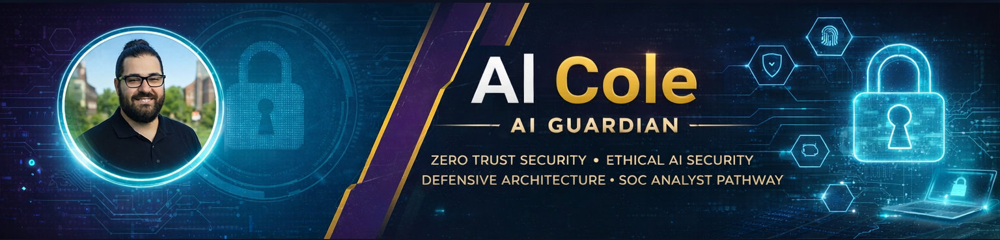

  

  <strong>Cybersecurity Portfolio • Zero Trust • IAM • SOC • Defensive Security Engineering • Ethical AI Security</strong>

  
  
  
  

  
  
  
  
  

---

## About Me

I am a cybersecurity student at the **University at Albany** building practical portfolio projects focused on **zero trust, active defense, security engineering, browser security, and IT support**.

My work is shaped by both technical training and my academic background in **AI Ethics & Philosophy**, which influences how I think about trust, privacy, access control, explainability, and responsible security design.

I am especially interested in building systems that do more than block threats. I want to build security tools that can **evaluate trust intelligently, enforce least privilege, detect risk early, explain decisions clearly, and protect real people in real environments**.

---

## Professional Focus

- **B.S. in Cybersecurity** at the University at Albany
- **Self-Designed Concentration:** AI-Driven Cybersecurity & Ethical Hacking
- **Minor:** AI Ethics & Philosophy
- Portfolio emphasis on **Zero Trust, SOC-aligned defense, access control, risk scoring, and user protection**
- Building toward **SOC Analyst, Security Analyst, IAM, and Security Engineering** opportunities

---

## Featured Projects

### AI Guardian Assistant: Project Labyrinth
A defensive **zero-trust security simulator** built with **Next.js, React, Tailwind CSS, and SQLite**.

Project Labyrinth demonstrates how modern systems can evaluate access requests dynamically using contextual security signals rather than relying on static permissions alone.

#### Highlights
- Dynamic **Allow / Deny / Route** decision engine
- Owner-only private vault simulation
- Policy matrix and least-privilege enforcement
- Labyrinth deception environment for suspicious sessions
- Audit and threat intelligence logging
- Context-aware decisioning based on MFA, device trust, unusual location, anomaly scoring, and role sensitivity

#### Core Themes
`Zero Trust` `Least Privilege` `Adaptive Access Control` `Defensive Security Design` `Threat Awareness` `Deception Defense`

#### Repository
[View Project Labyrinth](https://github.com/AL91Cole/ai-guardian-assistant-project-labyrinth)

---

### AI Guardian Web Shield
A privacy-first **browser security extension** designed to help users evaluate websites, downloads, forms, and links with calm, plain-language risk guidance.

This project reflects my interest in combining **security awareness, browser risk evaluation, and human-centered security design**.

#### Highlights
- Live website risk scoring
- Risk indicators in search results
- Suspicious download and link warnings
- Floating page score indicator
- Simple **Learn Why** explanations for flagged risks
- Privacy-first design with a local-analysis mindset

#### Core Themes
`Browser Security` `Threat Detection Concepts` `Phishing Awareness` `Security UX` `Risk Communication` `Privacy-First Design`

#### Repository
[View AI Guardian Web Shield](https://github.com/AL91Cole/ai-guardian-web-shield)

---

## Academic Focus

My academic path combines technical cybersecurity study with ethical and human-centered analysis.

### Degree Path
- **B.S. in Cybersecurity** — University at Albany
- **Concentration:** AI-Driven Cybersecurity & Ethical Hacking
- **Minor:** AI Ethics & Philosophy

### Areas of Interest
- Zero Trust Architecture
- Identity and Access Management
- Security Operations
- Threat Detection
- Incident Response
- Defensive Security Engineering
- Ethical AI Security
- Privacy-aware System Design
- Trustworthy and Explainable Security Systems

---

## Technical Skills

### Security
- Cybersecurity
- Security Operations (SOC)
- Threat Detection
- Incident Response
- Identity & Access Management
- Access Control
- Zero Trust Architecture
- Intrusion Detection
- Network Security
- Infrastructure Security
- SIEM concepts
- Governance, Risk, and Compliance
- Vulnerability Assessment
- Security Awareness

### Systems and Networking
- Windows
- Linux
- TCP/IP
- DNS
- DHCP
- VPN
- Wireless Networking
- Network Administration
- Operating Systems
- Desktop Support
- Hardware Troubleshooting
- IT Support & Troubleshooting

### Development
- JavaScript
- Next.js
- React
- Tailwind CSS
- SQLite
- SQL
- Python
- Web Development
- PowerShell

### Professional Strengths
- Technical Analysis
- Documentation
- Report Writing
- Written Communication
- Customer Support
- Troubleshooting
- Risk Awareness
- Interpersonal Communication

---

## Skills Matrix

| Domain | Tools / Concepts | Current Strength |
|---|---|---|
| Security Architecture | Zero Trust, Least Privilege, Access Control | Strong |
| Security Operations | Threat Detection, Incident Response, SOC Concepts | Strong |
| Identity Security | IAM, MFA Logic, Trust Evaluation | Strong |
| Browser Security | Risk Scoring, Link Analysis, User Warnings | Strong |
| Systems Support | Windows, Linux, Troubleshooting, Desktop Support | Strong |
| Networking | TCP/IP, DNS, DHCP, VPN, Wireless Networking | Growing |
| Development | Next.js, React, Tailwind, JavaScript, SQLite | Strong |
| Scripting | Python, PowerShell, SQL | Growing |
| Responsible AI | AI Ethics, Trust, Human-Centered Security | Strong |

---

## Current Focus

I am currently focused on:
- Expanding practical cybersecurity portfolio projects
- Strengthening defensive architecture and zero-trust design skills
- Building projects aligned with SOC and security engineering workflows
- Improving browser and user-side threat protection ideas
- Growing my experience in systems troubleshooting and real-world technical support
- Developing a stronger foundation in secure, ethical, human-centered AI security

---

## Project Roadmap

### In Progress
- Expanding Project Labyrinth decision logic
- Refining AI Guardian Web Shield scoring and explanation systems
- Strengthening GitHub portfolio presentation and project documentation

### Next Builds
- Security logging and alert triage project
- IAM / RBAC policy testing lab
- Threat detection dashboard simulation
- Secure help desk / endpoint hardening project
- AI-assisted defensive analysis concept demo

### Longer-Term Goals
- Threat hunting style mini-lab
- Cloud security monitoring concept
- Portfolio case studies with security architecture writeups
- Expanded AI Guardian security ecosystem projects

---

## Career Direction

I am building toward opportunities in:
- Security Operations Center (SOC)
- Junior Security Analyst roles
- Security Engineering pathways
- Identity and Access Management
- IT support with security specialization
- Defensive cyber operations
- Ethical AI security and trustworthy systems design

---

## GitHub Stats

  
  

  

  

---

## Connect

  <a href="https://github.com/AL91Cole">GitHub</a> •
  <a href="https://www.linkedin.com/in/alan91cole">LinkedIn</a>

---

## Motto

  <strong>Building security tools that think critically, defend intelligently, and put trust, privacy, and people first.</strong>

