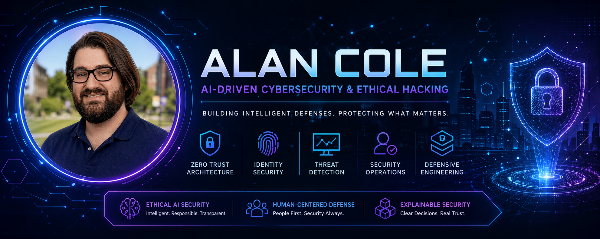

  

  

  

  

  
  
  
  
  

---

## Profile

Cybersecurity practitioner focused on designing **risk-aware, identity-informed defensive systems** aligned with modern Zero Trust principles.

Portfolio work emphasizes practical implementations of:

• least privilege access control  
• contextual authentication logic  
• defensive telemetry concepts  
• user-centered security tooling  
• transparent and explainable decision systems  

Academic concentration in **AI-driven cybersecurity** combined with a minor in **AI Ethics & Philosophy** informs a design approach that prioritizes **security effectiveness, accountability, and human impact**.

Interested in contributing to teams responsible for:

Security Operations • Identity Security • Threat Detection • Security Engineering • Secure Systems Architecture

---

## Featured Work

### AI Guardian Assistant — Project Labyrinth

Zero Trust security simulation platform demonstrating contextual access evaluation and defensive decision routing.

Simulated SOC-style alert generation based on anomalous access behavior

This project simulates how modern organizations evaluate access requests under Zero Trust principles, helping illustrate how identity, behavior, and context influence real-world security decisions.

Tech stack:
Next.js • React • Tailwind • SQLite

Key capabilities:

• dynamic allow/deny / route logic  
• Simulated identity-aware access decisions using contextual risk signals (device trust, anomaly score)  
• least privilege policy modeling  
• anomaly-aware decision factors  
• private vault access boundaries  
• structured audit logging concepts  
• deception routing for suspicious sessions  

Security concepts demonstrated:

Zero Trust Architecture  
Policy-based access control  
Behavior-aware decision logic  
Structured logging approach simulating SOC-level event visibility
Threat-aware defensive design  

Repository:
https://github.com/AL91Cole/ai-guardian-assistant-project-labyrinth

---

### AI Guardian Web Shield

Browser-based security awareness tool emphasizing risk visibility and user decision support.

Key capabilities:

• contextual site risk evaluation concepts  
• suspicious link pattern awareness  
• download risk signaling concepts  
• human-readable explanation-first security messaging  
• privacy-conscious architecture approach  

Security concepts demonstrated:

Browser security awareness  
Phishing risk indicators  
User-focused defensive tooling  
Security communication design  
Risk visibility strategies  

Repository:
https://github.com/AL91Cole/ai-guardian-web-shield

---

## Education

University at Albany  
Bachelor of Science — Cybersecurity

Concentration:
AI-Driven Cybersecurity & Ethical Hacking

Minor:
AI Ethics & Philosophy

Relevant focus areas:

Identity security  
Access control architecture  
Threat detection concepts  
Secure system design  
Responsible AI systems  

---

## Core Competencies

### Security Engineering Concepts

Zero Trust Architecture  
Identity & Access Management (IAM)  
Role-Based Access Control (RBAC)  
Least Privilege Principles  
Authentication & Authorization Concepts  
Threat Detection Concepts  
Incident Response Concepts  
Security Logging Concepts  
Defense-in-depth Principles  
Risk-based decision logic  

### Security Operations Foundations

Security Operations Center (SOC) concepts  
Threat analysis fundamentals  
Security event interpretation  
Log review methodology  
Attack surface awareness  
Vulnerability awareness  
Phishing indicators  
Endpoint risk awareness  

### Systems & Infrastructure

Windows  
Linux  
TCP/IP networking  
DNS  
DHCP  
VPN concepts  
Endpoint troubleshooting  
Operating systems  
System hardening concepts  

### Development & Technical Tools

JavaScript  
React  
Next.js  
Tailwind CSS  
SQLite  
SQL  
Python fundamentals  
PowerShell fundamentals  

### Professional Capabilities

Technical documentation  
Analytical reasoning  
Troubleshooting methodology  
Written communication  
Pattern recognition  
Security-focused thinking  
Attention to detail  

### Practical Exposure

Basic log analysis (simulated audit logs in Project Labyrinth)
TryHackMe labs (networking, Linux, web security)
Security event interpretation practice

---

## Skills Matrix

| Domain | Capabilities |
|--------|-------------|
| Identity Security | IAM, RBAC, authentication logic |
| Defensive Architecture | Zero Trust modeling |
| Security Monitoring | logging strategy concepts |
| Risk Evaluation | contextual decision logic |
| Endpoint Support | OS troubleshooting |
| Networking | TCP/IP, DNS, DHCP |
| Secure Development | React, Next.js |
| Responsible AI | ethics-informed design |

---

## Current Development Focus

Expanding portfolio depth in:

• identity-aware system design  
• defensive decision modeling  
• practical Zero Trust architecture concepts  
• security telemetry visibility concepts  
• user-protective tooling  
• applied ethical security design  

---

## Professional Direction

Actively developing capabilities aligned with:

Primary: Security Operations (SOC) / Threat Detection  
Secondary: Identity & Access Management (IAM)

---

## Contact

LinkedIn  
https://www.linkedin.com/in/alan91cole

GitHub  
https://github.com/AL91Cole

---

## Guiding Principle

Security should be technically strong, ethically grounded, and designed with real users in mind.
